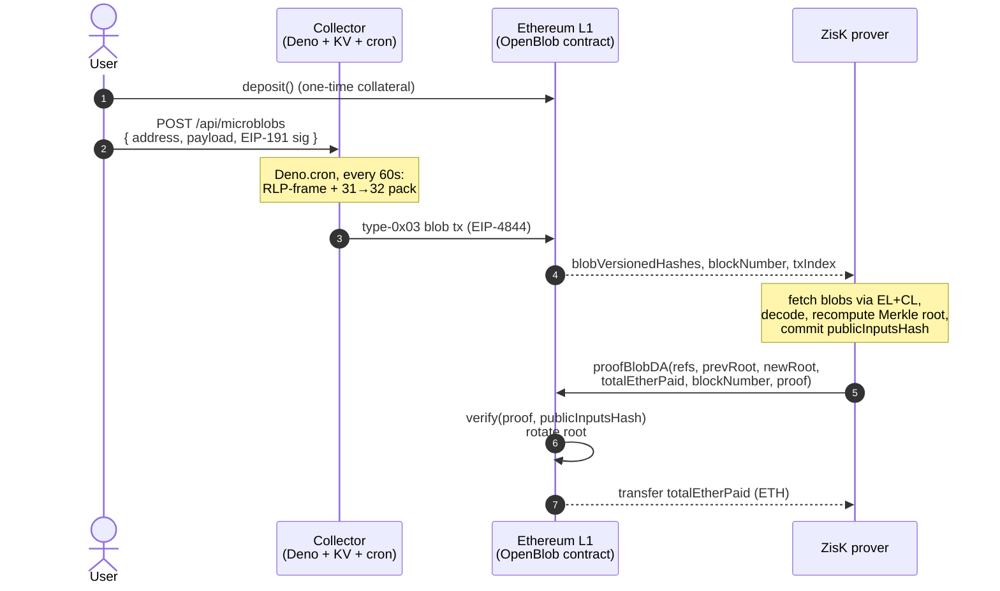

# OpenBlob

> Pay-per-byte data availability on Ethereum, settled by a ZK proof.

**Live on Sepolia at [openblob.space](https://openblob.space)** — connect a wallet, grab some Sepolia ETH from a faucet, deposit, sign a microblob, and watch it land in a real EIP-4844 blob within the next minute.

---

## Why

Posting an EIP-4844 blob costs the same whether you fill 100 bytes or 128 KiB. That makes Ethereum's cheapest data lane essentially unusable for anyone smaller than a rollup — a hobbyist who wants to anchor a tweet, a sensor reading, or a game move pays for 128 KiB of empty space.

OpenBlob is a pay-per-byte data-availability layer that fixes this. Users top up an on-chain collateral pot once, then fire-and-forget tiny *microblobs* over HTTP. A collector aggregates them, packs them into a real EIP-4844 blob every minute, and only gets paid back from the pot if it can prove — in zero knowledge — that the data it promised to publish actually landed in a blob the chain saw.

Cheap for users. Trustless for everyone. Honest by construction for the operator.

## How it works

1. **Deposit.** A user calls `deposit()` on the `OpenBlob` contract and parks some ETH as collateral. That's the only L1 touch they ever need.
2. **Sign & send a microblob.** From the dApp, the user signs an arbitrary payload with EIP-191 `personal_sign` and POSTs `{ address, payload, signature }` to the collector. No gas, no wallet pop-up beyond the signature.
3. **Bundle.** A `Deno.cron` job wakes up every minute, RLP-frames every pending microblob into a single logical stream, packs it into 4096 × 31-byte canonical BLS field elements, and ships the result as a type-0x03 blob transaction.
4. **Prove.** Off-chain, the operator runs a [ZisK](https://0xpolygonhermez.github.io/zisk/) zkVM circuit that:
   - fetches each blob it's claiming from the beacon chain by `(blockNumber, txIndex)`,
   - verifies `kzg_to_versioned_hash(commitment) == blobVersionedHash`,
   - decodes the blobs back into microblobs per the on-chain spec,
   - recomputes a state-transition root over `(nonce, amountSpent)` per user,
   - commits a single `publicInputsHash = keccak256(abi.encode(blobhashes, hashedData, prevRoot, newRoot, totalEtherPaid, blockhash, msg.sender))`.
5. **Settle.** The operator calls `proofBlobDA(...)` on L1. The contract reproduces the same digest, hands it to the verifier, rotates the Merkle root, and atomically pays out exactly the ETH owed for the bytes that were proven available. No proof, no payout — and `msg.sender` is bound into the digest, so nobody can front-run the settlement out of the mempool.

The operator is structurally *unable* to charge a user for data it didn't actually publish, because the only way to extract their ETH is a ZK proof that quotes a real on-chain blob.



## What's novel

A self-serve, *permissionless-on-the-user-side* data-availability service whose economics are enforced by a ZK proof of blob inclusion rather than by trust in the operator. The user never sends an L1 transaction after the initial deposit; the operator never gets paid for bytes it can't prove. The same pattern generalizes to any "I'll publish your data later, charge me only if I do" service — L2 sequencer inboxes, oracle feeds, social posts, on-chain notarization — without making each user wear the gas cost of a blob themselves.

## Why the building blocks matter

- **EIP-4844 blobs as the DA primitive.** The [spec](specs/spec.md) keeps every field element strictly canonical (`F[i][0] == 0x00`, 31-byte payload), supports entries that straddle blob boundaries, and frames them with canonical RLP — so the same encoding works whether a bundle fits in one blob or six.
- **ZisK zkVM for the prover.** Real Rust, real `keccak256`, patched at the workspace root to use ZisK's `syscall_keccak_f` so proving cost stays sane. We expose a full pipeline: emulator → execute → VADCOP prove/verify → final-minimal → PLONK SNARK wrap, ready to plug into an on-chain Groth16/PLONK verifier.
- **Per-entry EIP-191 signatures, kept out-of-band.** Signatures live in Deno KV, not in the blob — the blob carries only the bytes users paid for, and the circuit + collector together vouch for who signed what.
- **Boring, fast frontend.** React Router v7 (SSR) on Deno 2, wagmi + viem for wallets, Tailwind v4 + shadcn/ui. The whole collector — HTTP API, KV store, per-minute cron, SSR app — runs as a single Deno process.

## Repo layout

```
.
├── src/                 # Solidity contracts
│   ├── OpenBlob.sol     # collateral pot + proofBlobDA settlement
│   └── IVerifier.sol    # pluggable ZK verifier interface
├── script/              # Foundry deploy / deposit / simulate scripts
├── test/                # forge tests
├── specs/spec.md        # canonical blob encoding + signature scheme
├── collector/           # Deno + React Router v7 dApp + bundling cron
└── ziskProgram/         # ZisK zkVM workspace (guest + host + blob-sync)
```

Each subproject ships its own README:

- [`collector/README.md`](collector/README.md) — frontend, HTTP API, Deno cron bundler.
- [`ziskProgram/README.md`](ziskProgram/README.md) — guest circuit, host pipeline (emulate / execute / prove / minimal / PLONK).
- [`ziskProgram/blob-sync/README.md`](ziskProgram/blob-sync/README.md) — host-side EL+CL blob fetcher.
- [`specs/spec.md`](specs/spec.md) — blob encoding (§3 packing, §4 RLP framing, §5 EIP-191 signatures).

## Tech stack

- **Smart contracts:** Solidity 0.8.34, Foundry, EIP-4844 (`BLOBHASH`), pluggable `IVerifier`.
- **Prover:** ZisK zkVM, Rust, alloy + reqwest blob-sync (EL JSON-RPC + CL beacon API), `tiny-keccak` patched to ZisK's keccak syscall.
- **Collector:** Deno 2.x, React Router v7, Vite 7, wagmi 2 / viem 2, Deno KV, Deno Cron, Tailwind v4 + shadcn/ui, Biome.

## Try it

The hosted instance runs on **Sepolia** at **[openblob.space](https://openblob.space)** — no real ETH needed; any Sepolia faucet will do.

To run the whole stack locally:

```bash
# 1. Contracts
forge install foundry-rs/forge-std --no-commit
forge build
forge test -vv

# 2. Collector + dApp (http://localhost:3000)
cd collector
deno install
deno task dev

# 3. ZisK prover (full prove + verify, needs the ZisK toolchain)
cd ../ziskProgram
cargo run --release -p host
```

See each subproject's README for env vars, deployment, and the lighter-weight ZisK entrypoints (`run`, `execute`, `minimal`, `plonk`).

## License

MIT.
